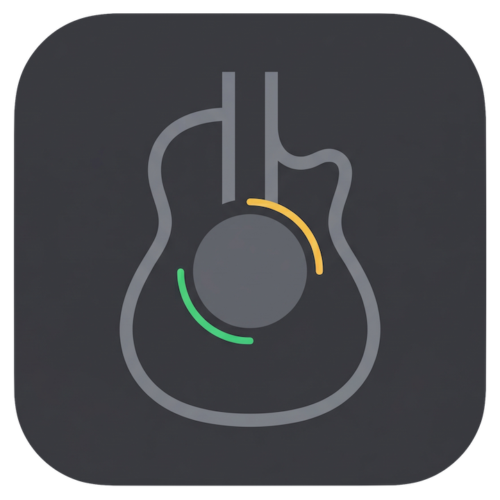

# Busker Live FX — User Manual

User guide for [Busker Live FX](https://apps.apple.com/app/busker-live-fx), an iOS/iPadOS multi-effector built for acoustic guitar and vocals on live / busking stages.

## Contents

- **[Full App Guide](user-guide.md)** — screen structure, channels, presets, audio interface setup
- **[Looper](looper.md)** — two-slot loop recorder (record / play / overdub / sync)
- **[MIDI Foot Controller Mapping](midi.md)** — remote-control presets, effects, and the looper
- **Per-effect manuals**:
  - [Tuner](effects/tuner.md)
  - [Compressor](effects/compressor.md)
  - [EQ](effects/eq.md)
  - [AMP Simulator](effects/amp.md)
  - [Solo Boost](effects/boost.md)
  - [IR Loader](effects/ir-loader.md)
  - [Doubler](effects/doubler.md)
  - [Chorus](effects/chorus.md)
  - [Delay](effects/delay.md)
  - [Reverb](effects/reverb.md)

## Language

- 🇬🇧 **English** (this page)
- 🇰🇷 [한국어](ko/README.md)

## About This Manual

This is the user-facing documentation for Busker Live FX. Screenshots shown inline are under `screenshots/` — each page tells you which image file to drop in. If you're looking for developer / DSP documentation, see the main app repository.

## License

Text and images in this repository are licensed under [Creative Commons Attribution 4.0 International (CC BY 4.0)](https://creativecommons.org/licenses/by/4.0/). You are free to share, adapt, and translate with appropriate credit.

**Trademarks**: "Busker Live FX", the Busker Live FX logo, app icon, and splash artwork are trademarks of 강경호 (joyull) and are **not** covered by the CC BY license. See [LICENSE](LICENSE) for details.

© 2026 강경호 (joyull)
