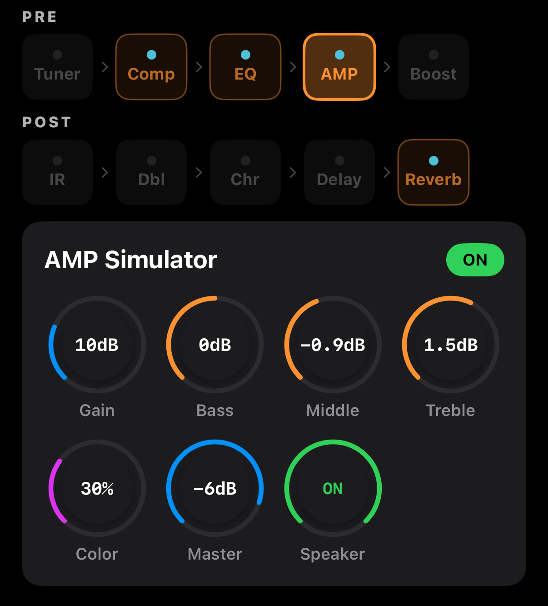

# AMP Simulator

Simulates an acoustic guitar amp. Unlike electric amps, this is mostly a **clean preamp + 3-band tone stack + Color character + speaker sim**.


<!-- SCREENSHOT: AMP — 4 knobs (Gain/Bass/Middle/Treble) + 2 more (Color/Master) + Speaker toggle -->

## Layout

```
┌────────────────────────────────────────────────┐
│  AMP Simulator                    [ ON ]       │
├────────────────────────────────────────────────┤
│   🎛 Gain   🎛 Bass   🎛 Middle  🎛 Treble     │
│   🎛 Color  🎛 Master [Speaker: ON ]           │
└────────────────────────────────────────────────┘
```

## Parameters

| Param | Range | Description |
|-------|-------|-------------|
| **Gain** | 0–40 dB | Preamp gain. Keep **low** for acoustic (0–10 dB) |
| **Bass** | −8 to +8 dB | Low shelf |
| **Middle** | −6 to +6 dB | Mid bell |
| **Treble** | −8 to +8 dB | High shelf |
| **Color** | 0–100 % | Preamp character — 0 = neutral, 100 = warm tube |
| **Master** | −60 to 0 dB | Final output level |
| **Speaker** | ON / OFF | Built-in cab sim (OFF = direct out) |

## Gain vs Master

- **Gain**: preamp drive level — higher adds mild saturation and harmonics
- **Master**: final output volume, doesn't affect the preamp stage

Acoustic usually starts at Gain 3–8 dB, Master −6 to −3 dB.

## Color

Color controls the **nonlinearity** of the preamp circuit:
- 0 %: transparent, linear — good for recording / line out
- 30–50 %: subtly warm (recommended default)
- 80–100 %: tube-like harmonics, thickens strumming

## Speaker Sim

**ON**: models a small acoustic amp cab (8–10 inch) — high rolloff + low resonance.
- **Live PA** or **DI recording**: **ON recommended**. Flat-response PA speakers on a DI signal sound harsh.
- **If using the IR Loader**: **OFF** — the IR replaces the cab.

## Example Settings

### Folk / pop strumming
- Gain 5 dB, Bass +1, Middle 0, Treble +2, Color 40 %, Master −3 dB, Speaker ON

### Fingerstyle recording
- Gain 2 dB, Bass 0, Middle −1, Treble +1, Color 20 %, Master −6 dB, Speaker OFF

### Warm body (dreadnought)
- Gain 6 dB, Bass +2, Middle +1, Treble 0, Color 60 %, Master −4 dB, Speaker ON

### Live safe
- Gain 4 dB, Bass 0, Middle 0, Treble 0, Color 30 %, Master −8 dB, Speaker ON
- Refine with EQ and/or IR Loader

## Relationship with IR Loader

The chain order is **AMP → Boost → IR Loader**. If Speaker is ON *and* an IR is loaded, you'll get two cabinet layers stacked and the sound gets muddy. With an IR loaded, **turn Speaker OFF** and let the IR be the sole cabinet.
