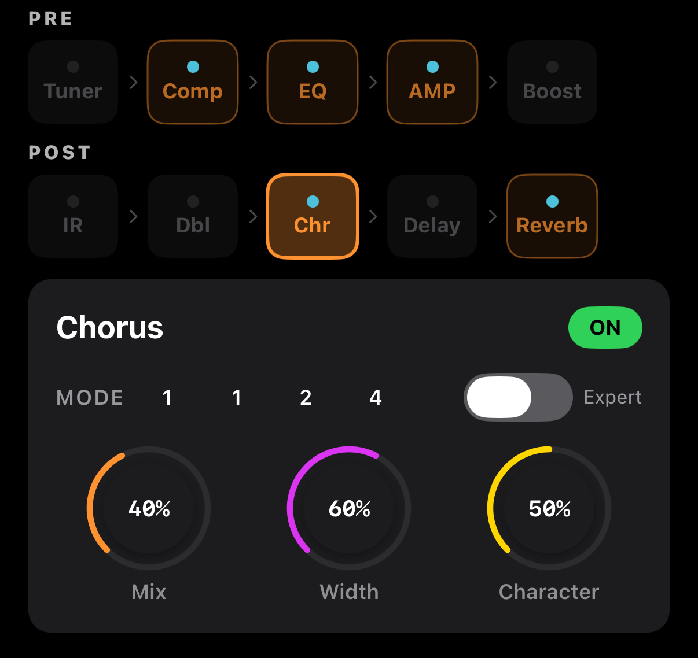

# Chorus

Subtle pitch and time modulation that makes the tone **move**. On acoustic guitar it adds gentle space or a "wet" character.



## Layout

### Normal
```
┌──────────────────────────────────────────────┐
│  Chorus                           [ ON ]     │
├──────────────────────────────────────────────┤
│  MODE  [1] [2] [3] [4]              [Expert] │
│                                               │
│       🎛 Mix     🎛 Width   🎛 Character     │
└──────────────────────────────────────────────┘
```

### Expert
```
┌──────────────────────────────────────────────┐
│  Chorus                           [ ON ]     │
├──────────────────────────────────────────────┤
│  EXPERT MODE                        [Expert] │
│                                               │
│   🎛 Mix   🎛 Rate   🎛 Depth  🎛 Width      │
│                                               │
│             🎛 Character                      │
└──────────────────────────────────────────────┘
```

## Mode (1–4)

Four internal algorithm presets. Higher numbers = richer modulation.

| Mode | Character | Use for |
|------|-----------|---------|
| **1** | Classic single LFO, smooth | Gentle backing |
| **2** | Dual stereo LFO, wide | General-purpose chorus |
| **3** | Complex LFO, rich | Ambient fingerstyle |
| **4** | Deep modulation, spacey | Experimental tones |

## Main Parameters

| Param | Range | Description |
|-------|-------|-------------|
| **Mix** | 0–100 % | Dry ↔ Chorus blend |
| **Width** | 0–100 % | Stereo width |
| **Character** | 0–100 % | Tone color (0 = bright and thin, 100 = thick and dark) |

## Expert Parameters

Expert mode exposes direct LFO control.

| Param | Range | Description |
|-------|-------|-------------|
| **Rate** | 0.05–1.5 Hz | LFO speed |
| **Depth** | 0–100 % | Modulation depth |

Mode buttons are hidden in Expert mode, but the internal value is preserved.

## Examples

### Gentle ambience
- Mode **2**, Mix 20 %, Width 60 %, Character 30 %
- Subtle space behind the guitar

### '80s pop strumming
- Mode **3**, Mix 40 %, Width 100 %, Character 60 %
- Clear stereo movement

### Ambient fingerstyle
- Mode **4**, Mix 35 %, Width 80 %, Character 70 %
- Expert: Rate 0.3 Hz, Depth 50 %
- Slow deep modulation, dreamy feel

### Barely-there refinement
- Mode 1, Mix 10 %, Width 30 %, Character 0 %
- A touch of movement without being obvious

## Rate × Depth Combinations (Expert)

| Combo | Feel |
|-------|------|
| Slow rate + shallow depth | Almost inaudible, subtle presence |
| Slow rate + deep depth | Slow wobble, tape-wow |
| Fast rate + shallow depth | Clear classic chorus |
| Fast rate + deep depth | Vibrato / very liquid |

For natural acoustic chorus, Rate **0.3–0.8 Hz**, Depth **30–60 %**.

## Signal Chain Tip

Chorus sits after Doubler and before Delay. Feeding a modulated signal into the delay creates a richer spatial feel.
