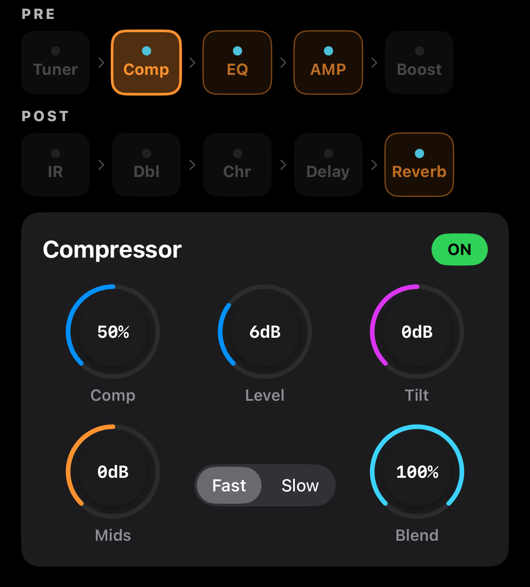

# Compressor

A dynamics processor that reduces loud parts and lifts quieter ones. On acoustic guitar it evens out fingerpicking attacks so the instrument sits consistently in a mix or live PA.

## Parameters

| Param | Range | Description |
|-------|-------|-------------|
| **Comp** | 0–100 % | Compression amount — higher = softer attack, longer sustain |
| **Level** | 0–20 dB | Make-up gain after compression |
| **Tilt** | −6 to +6 dB | Low/high tonal tilt (+ = bright, − = warm) |
| **Mids** | −10 to +10 dB | Mid-range boost/cut (presence) |
| **Attack** | Fast / Slow | Transient response — Fast tames attacks, Slow lets them through |
| **Blend** | 0–100 % | Parallel mix of compressed and dry signal |

### Fingerpicking (default)
- Comp 40–60 %, Level 4 dB, Attack **Slow**, Blend 70 %
- Keeps the pluck crisp while extending sustain

### Strumming
- Comp 30–50 %, Level 2 dB, Attack **Fast**, Blend 100 %
- Evens out strum peaks; don't lower Blend

### Live-safe
- Comp 70–80 %, Level 6 dB, Attack Fast, Blend 100 %, Tilt −1 dB
- Reduces feedback risk and stabilizes input to the amp

### When to use Tilt / Mids
- **Tilt**: if compression dulls the tone, add **+2 dB** to restore brightness
- **Mids**: if the guitar gets buried in a mix, add **+3 dB** (around 500 Hz–1 kHz)

## About Blend

Blend 100 % = compressed signal only. Blend 70 % = 70 % compressed + 30 % dry in **parallel**.

Parallel compression **preserves the original dynamics while adding sustain**, which is why it's a go-to technique for natural-sounding instruments like acoustic guitar.
