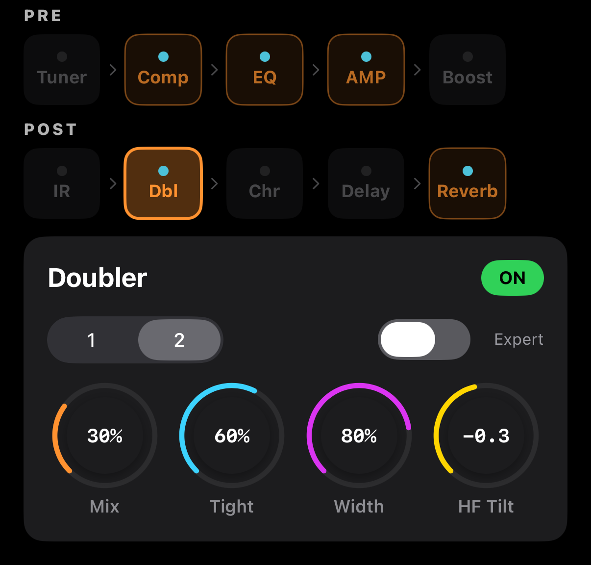

# Doubler

Makes a single guitar track sound **doubled or widened**, mimicking the stereo multi-take technique common in acoustic recordings.


<!-- SCREENSHOT: Doubler — Voices toggle + Expert switch + 4 main knobs + (when Expert) 3 extra knobs -->

## Layout

```
┌───────────────────────────────────────────────┐
│  Doubler                           [ ON ]     │
├───────────────────────────────────────────────┤
│   [ Voices: 1 | 2 ]                 [Expert]  │
│                                                │
│   🎛 Mix    🎛 Tight   🎛 Width  🎛 HF Tilt   │
│                                                │
│   ─── Expert only (when toggle is on) ────    │
│   🎛 Detune  🎛 Spread  🎛 Jitter             │
└───────────────────────────────────────────────┘
```

## Main Parameters

| Param | Range | Description |
|-------|-------|-------------|
| **Voices** | 1 / 2 | Number of doubled layers — 1 = mono double, 2 = stereo double |
| **Mix** | 0–100 % | Dry vs doubled blend |
| **Tight** | 0–100 % | Timing accuracy of the copies — higher = closer to the original |
| **Width** | 0–100 % | Stereo width (relevant when Voices = 2) |
| **HF Tilt** | −3 to +3 dB | High-frequency balance of the doubled layers |

## Expert Parameters

Flip the Expert toggle to reveal three finer controls.

| Param | Range | Description |
|-------|-------|-------------|
| **Detune** | ±0–25 cents | Pitch variation of the doubled layers |
| **Spread** | 0.5× to 2.0× | Timing gap multiplier between layers |
| **Jitter** | 0–100 % | Random variation — adds a human-hand feel |

## Examples

### Classic stereo double (folk / pop recording)
- Voices **2**, Mix 35 %, Tight 60 %, Width 80 %, HF Tilt +1 dB
- Natural stereo spread while the center image holds

### Subtle thickening
- Voices **1**, Mix 20 %, Tight 80 %, Width 0 %, HF Tilt 0 dB
- Thicker mono tone, no stereo effect

### Wide layered feel (ambient / worship)
- Voices 2, Mix 50 %, Tight 30 %, Width 100 %, HF Tilt +2 dB, Expert ON
- Detune ±15 c, Spread 1.5×, Jitter 40 %
- Sounds like multiple guitarists playing together

### Watch out for
- Tight 0 % + Detune > ±20 c: sounds out of tune
- Width 100 % + 1 Voice: Width has no effect (no second layer)
- Jitter 80 %+: unstable and unnatural

## Voices 1 vs 2

- **1 Voice (mono double)**: original + one layer. Width is irrelevant. On stereo input the layer spreads slightly L/R.
- **2 Voices (stereo double)**: original + left/right layers. Higher Width separates them further.

## Signal Chain Tip

Doubler sits **after IR Loader, before Chorus**. The idea is to widen a finished tone before adding modulation or reverb. When stacking, keep Doubler before Reverb for the most natural result.
