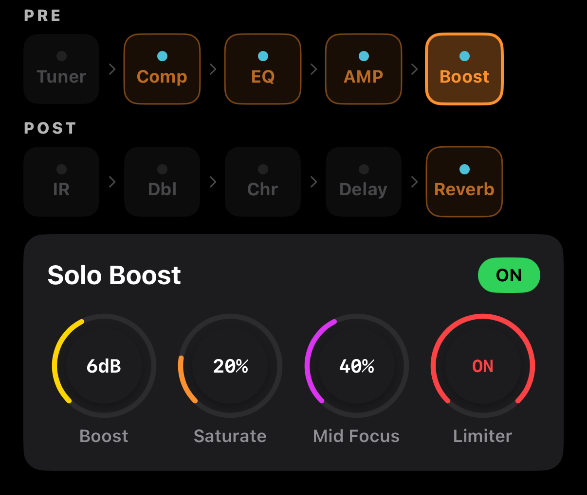

# Solo Boost — 솔로 부스트

솔로 구간에서 **볼륨을 올리고 중역을 강조**해 돋보이게 만드는 이펙트. 일반 부스터 페달과 달리 어쿠스틱 기타에 맞춘 Mid Focus와 Limiter가 포함되어 있습니다.



## 화면 구성

```
┌─────────────────────────────────────────────┐
│  Solo Boost                      [ ON ]     │
├─────────────────────────────────────────────┤
│   🎛 Boost   🎛 Saturate                    │
│   🎛 Mid Focus   [ Limiter: ON ]            │
└─────────────────────────────────────────────┘
```

## 파라미터

| 파라미터 | 범위 | 설명 |
|---------|------|------|
| **Boost** | 0–15 dB | 전체 볼륨 부스트 |
| **Saturate** | 0–100 % | 부드러운 소프트클립 새츄레이션. 높일수록 음색 두꺼워지고 하모닉 추가 |
| **Mid Focus** | 0–100 % | 1–3 kHz 중역 강조. 솔로 라인이 믹스에서 튀어나오게 함 |
| **Limiter** | ON / OFF | 부스트로 인한 피크 제한 (스피커·앰프 보호) |

## 사용 시나리오

### 기본 솔로 부스트
- Boost **+6 dB**, Saturate 10%, Mid Focus 30%, Limiter ON
- 코러스 파트에서 1절 → 2절 올라갈 때, 솔로 진입할 때 풋스위치로 ON

### 드라이브 느낌 약간 추가
- Boost +4 dB, Saturate 40%, Mid Focus 20%
- 약간의 그릿으로 어쿠스틱 스트러밍에 에지 추가

### 존재감 + 크림
- Boost +8 dB, Saturate 15%, Mid Focus 60%, Limiter ON
- 밴드 속에서 솔로 들림. Mid Focus를 높여 귀에 걸리는 주파수 확보

## MIDI 매핑 추천

풋스위치에 **Boost Bypass**를 매핑해서 발로 ON/OFF. [MIDI 가이드](../midi.md) → Effect 섹션 → Boost 선택.

## 주의사항

- Boost + AMP Gain 조합이 과하면 **피드백·디스토션**이 생길 수 있음. Limiter를 항상 ON으로 두는 걸 추천.
- Saturate가 50%를 넘으면 어쿠스틱의 자연스러움이 줄어듦. 솔로 강조용으로는 10–30%가 적당.
- 라이브에서는 **Boost +6 dB 이하**가 안전. 그 이상이면 전체 믹스 균형이 깨질 수 있습니다.
