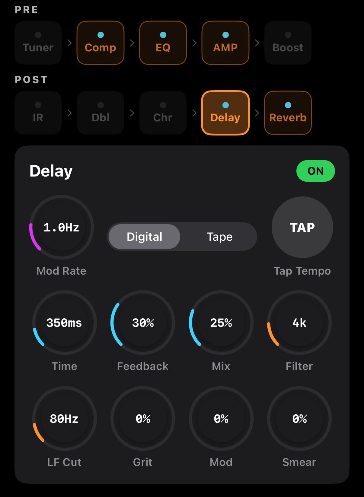

# Delay — 딜레이

입력 신호를 일정 시간 늦춰 반복 재생하는 이펙트. **Digital** (깨끗하고 정확)과 **Tape** (따뜻하고 유기적) 두 가지 모드. 어쿠스틱 기타에서는 핑거스타일의 공간감·앰비언트 레이어링·슬랩백 에코 등 다양하게 쓰입니다.


<!-- SCREENSHOT: Delay — 상단 Mod Rate + Mode 선택 + TAP, Tape 시 Normal/Fast 피커 추가 표시 -->

## 화면 구성

```
┌───────────────────────────────────────────────────┐
│  Delay                                [ ON ]      │
├───────────────────────────────────────────────────┤
│  🎛 Mod Rate    [ Digital | Tape ]    [ TAP ]     │  ← Row 1
│                 [ Normal  | Fast ]                │     (Tape 시만)
│                                                    │
│  🎛 Time  🎛 Feedback  🎛 Mix   🎛 Filter/Age     │  ← Row 2
│                                                    │
│  🎛 LF Cut  🎛 Grit/Bias  🎛 Mod   🎛 Smear/LoC   │  ← Row 3
└───────────────────────────────────────────────────┘
```

> ⚠️ **파라미터 라벨이 Mode에 따라 바뀝니다.** Digital ↔ Tape 전환 시 Filter/Age, Grit/Bias, Mod/Wow·Flut, Smear/Lo Contour, Mod Rate/Crinkle이 같은 노브 위치에서 라벨만 바뀌어요.

## Mode

### Digital
깨끗하고 정확한 반복. 핑거스타일·앰비언트에 적합. 60~2500ms 범위.

### Tape (dTape)
테이프 머신의 자연스러운 열화를 재현:
- **wow/flutter/crinkle**로 미세한 피치 흔들림
- 테이프 saturation으로 반복마다 따뜻하게 어두워짐
- Speed (Normal/Fast) 피커 추가 등장
  - **Normal**: 표준 (60–2500ms)
  - **Fast**: 하이파이 (30–1250ms, 더 넓은 주파수)

## 파라미터

| 파라미터 | 범위 | 설명 |
|---------|------|------|
| **Time** | 60–2500 ms | 딜레이 시간 |
| **Feedback** | 0–100 % | 반복 횟수 (100%=무한). Tape는 자동 saturation 제한 |
| **Mix** | 0–100 % | Dry/Wet 비율. 연주 중 자동 ducking 적용 |
| **Filter** (Digital) / **Age** (Tape) | 1k–20k Hz | 고역 특성 — Digital: 단순 HF 컷 / Tape: 테이프 노화 정도 |
| **LF Cut** | 20–500 Hz | 피드백 루프 내 저역 컷 |
| **Grit** (Digital) / **Bias** (Tape) | 0–100 % | Digital: 리피트에 디스토션 / Tape: 테이프 바이어스 |
| **Mod** (Digital) / **Wow/Flut** (Tape) | 0–100 % | Digital: 단순 모듈레이션 / Tape: wow+flutter 깊이 |
| **Mod Rate** (Digital) / **Crinkle** (Tape) | 0.1–5 Hz | Digital: LFO 속도 / Tape: 테이프 결함 빈도 |
| **Smear** (Digital만) | 0–100 % | 리피트 어택 소프트닝 (Digital) |
| **Lo Contour** (Tape만) | 0–100 % | 리피트 저역 조정 (Tape) |

## TAP 템포

오른쪽 상단 둥근 **TAP** 버튼을 원하는 템포로 연타 → Time이 자동 계산되어 설정됩니다. 풋컨트롤러로도 매핑 가능 ([MIDI 가이드](../midi.md) Global → Tap Tempo).

## Auto-Duck

연주 중에는 딜레이 신호가 **40%로 자동 감쇠**됩니다. 연주가 멈추면 딜레이가 살아나는 방식으로, 마음에 들지 않으면 Mix를 올려서 어색함을 덮을 수 있습니다.

## 추천 세팅

| 용도 | Time | Feedback | Mix | Filter/Age | Mode | Mod |
|------|------|----------|-----|------------|------|-----|
| 미묘한 앰비언스 | 120ms | 20% | 15% | 3.5kHz | Digital | 0% |
| Slapback | 100ms | 5% | 20% | 5kHz | Tape Normal | 0% |
| 핑거스타일 | 350ms | 35% | 20% | 4kHz | Digital | 0% |
| 앰비언트/워십 | 700ms | 50% | 30% | 3kHz | Digital | 15% |
| 따뜻한 에코 | 400ms | 40% | 25% | 2.5kHz (Age) | Tape Normal | 0% |
| 긴 사운드스케이프 | 1200ms | 60% | 40% | 2kHz | Digital | 10% |

## Feedback 팁

- **0–10 %**: 단일 에코 (slapback)
- **20–40 %**: 자연스러운 반복
- **50–70 %**: 긴 테일 (앰비언트)
- **80 %+**: 자기 발진 직전 — 주의!  
  Tape 모드에서는 saturation으로 자동 제한됨

## Time 범위 힌트

- **80–150ms**: Slapback / 짧은 앰비언스
- **250–400ms**: 핑거스타일 기본
- **500–1000ms**: 앰비언트 / 워십
- **1000ms+**: 사운드스케이프, 패드

## Digital vs Tape 비교

| 항목 | Digital | Tape |
|------|---------|------|
| 정확도 | 높음 (정밀 반복) | 낮음 (흔들림 의도) |
| 고역 | 유지 가능 | 반복마다 어두워짐 |
| 느낌 | 깨끗함 | 따뜻함, 유기적 |
| 추천 용도 | 핑거스타일, 앰비언트, 프리시전 | 스트러밍, 솔로, 빈티지 |
