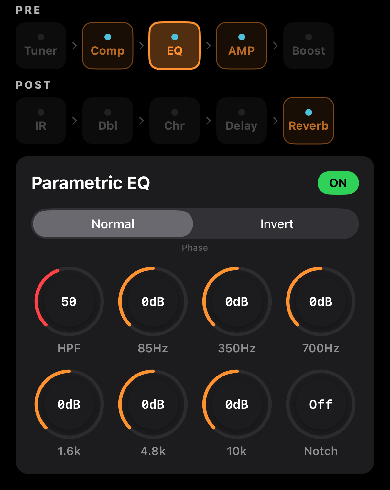

# EQ — 파라메트릭 이퀄라이저

6밴드 EQ + 하이패스 + 노치 + 위상 반전. 어쿠스틱 기타 특유의 **피드백 주파수**와 **박스토니(공명)** 를 잡기 위해 설계되었습니다.



## 화면 구성

```
┌─────────────────────────────────────────────────┐
│  Parametric EQ                       [ ON ]     │
├─────────────────────────────────────────────────┤
│     [ Normal | Invert ]   Phase                 │
│                                                  │
│   🎛 HPF   🎛 85Hz   🎛 350Hz  🎛 700Hz         │  ← Row 1
│   🎛 1.6k  🎛 4.8k   🎛 10k    🎛 Notch         │  ← Row 2
└─────────────────────────────────────────────────┘
```

## 파라미터

| 파라미터 | 범위 | 용도 |
|---------|------|------|
| **Phase** | Normal / Invert | 위상 180° 반전 — 피드백 제어, 믹스 위상 보정 |
| **HPF** (High Pass) | Off, 20–120 Hz | 저역 컷오프. 발판 쿵소리·무대 럼블 제거 |
| **85 Hz** | −9 to +9 dB | 저역 바디 (boomy 영역) |
| **350 Hz** | −9 to +9 dB | 박스토니 (어쿠스틱 공명 중심) |
| **700 Hz** | −9 to +9 dB | 중저역 (나무 톤) |
| **1.6 kHz** | −9 to +9 dB | 중역 (핑거 어택) |
| **4.8 kHz** | −9 to +9 dB | 고역 존재감 (pick 노이즈) |
| **10 kHz** | −9 to +9 dB | 초고역 (공기감) |
| **Notch** | Off, 20–300 Hz | 한 주파수만 날카롭게 컷. 피드백 제거용 |

## 어쿠스틱 기타 EQ 노하우

### 기본 톤 정리 (출발점)
- **HPF 80 Hz**: 럼블 제거
- **350 Hz: −3 dB**: 박스토니 줄임 (거의 모든 어쿠스틱에 효과 있음)
- **4.8 kHz: +2 dB**: 존재감 강화
- **10 kHz: +1 dB**: 미세한 공기감

### 피드백 대응
1. **HPF**를 80–100 Hz 정도로 올려 저역 피드백 제거
2. 피드백이 나면 어떤 주파수인지 파악 → **Notch**로 정확히 컷
   - 일반적인 드레드넛 피드백: 100–220 Hz
   - OM/파라 모델: 200–350 Hz

### Phase Invert는 언제?
- **라이브에서 모니터와 간섭**으로 저역이 얇아질 때 반전해 보기
- **두 마이크로 같은 기타를 녹음**할 때 위상 정렬
- 반전해서 소리가 두꺼워지면 원래 상태가 위상 문제였던 것

### 밴드별 장르 참고

| 장르 | 85 Hz | 350 Hz | 700 Hz | 1.6k | 4.8k | 10k |
|------|-------|--------|--------|------|------|-----|
| Fingerstyle | 0 | −2 | −1 | 0 | +2 | +1 |
| Strumming (팝) | +1 | −3 | 0 | 0 | +3 | +1 |
| Bluegrass/flatpicking | 0 | −4 | −1 | +1 | +4 | +2 |
| Ambient/layer | +1 | −2 | 0 | −1 | +1 | +2 |

## 신호 순서 참고

EQ 위치는 시그널 체인에서 **Comp 다음, AMP 전**입니다. AMP 시뮬의 톤 스택이 따로 있으니, EQ로는 **피드백·공명 제거·전체 밝기 조정** 역할만 하는 게 일반적입니다.
