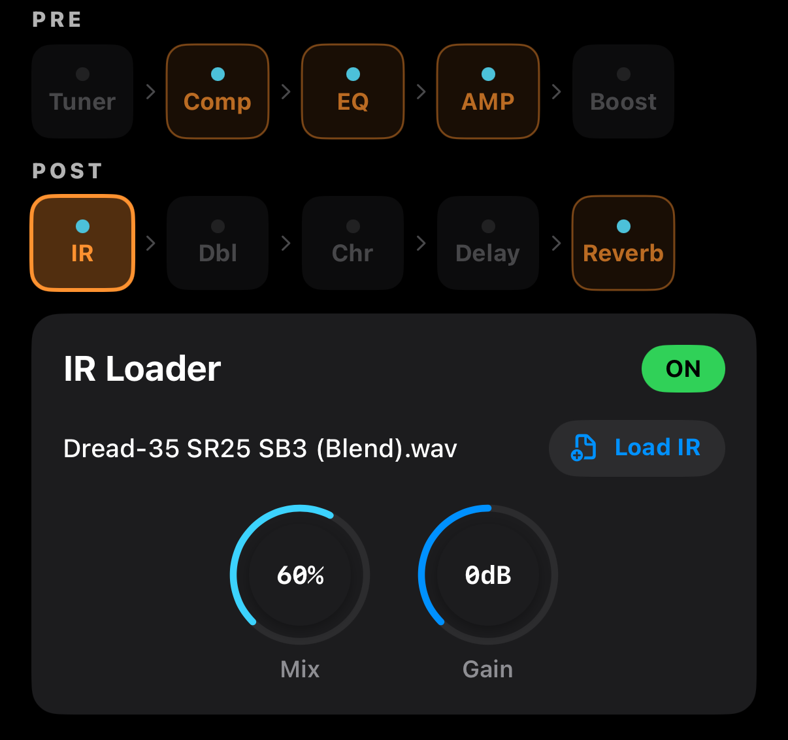

# IR Loader — 임펄스 응답 로더

WAV/AIFF 파일을 로드해 **기타 바디/마이크/방/스피커의 녹음 특성**을 그대로 시뮬레이션합니다. 어쿠스틱 기타 IR은 주로 **바디 IR**(고급 마이크로 녹음한 특정 어쿠스틱의 공명 특성)이 많이 쓰입니다.



## 화면 구성

```
┌──────────────────────────────────────────────┐
│  IR Loader                         [ ON ]    │
├──────────────────────────────────────────────┤
│  my_acoustic_IR.wav            [📄 Load IR ] │
│                                               │
│             🎛 Mix          🎛 Gain           │
└──────────────────────────────────────────────┘
```

## 파라미터

| 파라미터 | 범위 | 설명 |
|---------|------|------|
| **Load IR** | 버튼 | WAV/AIFF 파일 선택 (iOS Files 앱에서) |
| **Mix** | 0–100 % | Dry(원음) ↔ Wet(IR 처리) 비율 |
| **Gain** | −12 to +12 dB | IR 처리 후 레벨 보정 |

## IR이란?

IR(Impulse Response)은 **특정 공간·마이크·스피커의 주파수/시간 응답을 캡처한 파일**입니다. 신호를 IR로 컨볼루션하면 그 공간에서 녹음한 듯한 결과물이 나옵니다.

어쿠스틱 기타용 IR의 종류:
- **Body IR**: 특정 기타(예: Martin D-28)의 바디 공명을 캡처. 저렴한 픽업 장착 기타를 고급 마이크 녹음 톤으로
- **Room IR**: 스튜디오·교회·체임버 등 공간의 잔향
- **Mic IR**: 특정 마이크(예: Neumann U87)의 주파수 특성
- **Speaker IR**: 일렉트릭 앰프 캐비닛 (어쿠스틱에는 권장하지 않음)

## 사용 방법

### 1. IR 파일 준비
- WAV 또는 AIFF 형식
- 48 kHz 권장 (앱 기본 샘플레이트)
- 길이 200ms 이하 (어쿠스틱용은 대부분 짧음)

유명한 무료/유료 IR 팩:
- **3 Sigma Audio** — Martin, Taylor, Gibson 어쿠스틱 바디 IR
- **ML Sound Lab** — 스튜디오/룸 IR
- **IRs made by user** — 본인 기타 녹음해서 만들기

### 2. iOS 기기에 파일 저장
- iCloud Drive, Dropbox, AirDrop 등으로 파일 앱(Files)에 복사.
- 또는 컴퓨터에서 iTunes/Finder로 앱 컨테이너에 넣기.

### 3. 앱에서 로드
1. IR Loader 이펙트 선택 → 에디터 헤더 **ON** 확인.
2. **Load IR** 버튼 탭 → iOS 파일 선택 화면.
3. 원하는 WAV/AIFF 파일 선택 → 자동 로드.
4. 파일명이 표시되면 성공.

### 4. 블렌드
- **Mix**: 처음에는 70–100%로 설정해 IR 효과를 확인.
- **Gain**: IR 로드 후 볼륨이 변하면 보정.

## 추천 세팅

### 바디 IR (픽업 → 마이크 사운드)
- Mix **80–100%**, Gain 0 dB
- Speaker Sim(AMP Simulator) **OFF** (바디 IR이 이미 완성된 톤)

### 룸 IR (공간감 추가)
- Mix **30–50%**, Gain −3 dB
- 기존 톤 유지하면서 공간 보강

### 여러 IR 혼합 기법
앱 자체에는 1개의 IR만 로드 가능하지만, **AMP Speaker Sim + IR Loader**를 조합해 캐비닛 + 바디 톤을 이중 적용하거나, Reverb의 Room을 IR 효과와 함께 사용하는 방식으로 톤 레이어링 가능.

## IR Loader와 AMP Speaker의 관계

| 구성 | 권장 설정 |
|------|----------|
| 픽업 직결 (바디 IR 있음) | AMP Speaker **OFF**, IR Mix 100% |
| 픽업 직결 (IR 없음) | AMP Speaker **ON** |
| 마이크 수음 (IR 없음) | AMP Speaker **OFF** (이미 마이크 톤) |
| 마이크 + 룸 IR | AMP Speaker **OFF**, IR Mix 30-40% |
