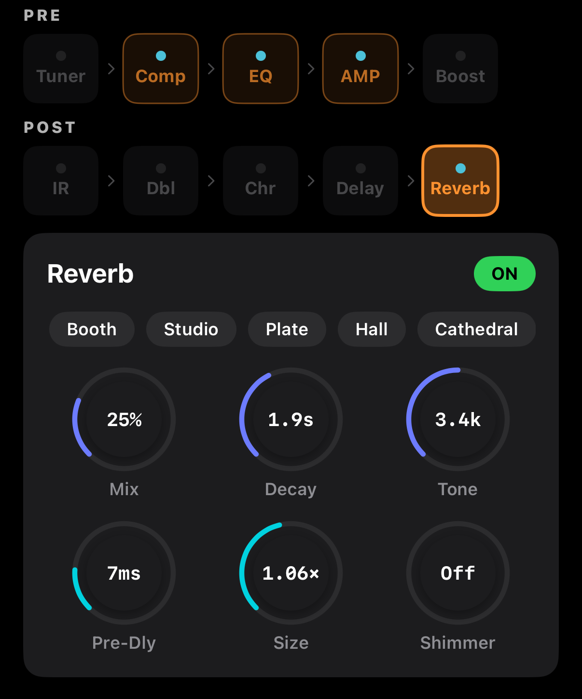

# Reverb — 리버브

공간감을 부여하는 이펙트. Dattorro Plate 기반의 알고리즘으로, 5가지 룸 프리셋과 5개 메인 노브(+선택적 Shimmer)로 어쿠스틱 기타에 적합한 자연스러운 공간을 만듭니다.

## 룸 프리셋

상단 가로 스크롤 버튼을 탭하면 Mix/Decay/Tone/Pre-Dly/Size 5개가 한번에 프리셋 값으로 변경됩니다.

| 프리셋 | 느낌 | RT60 (Decay) | Size |
|--------|------|-------------|------|
| **Booth** | 작고 건조 (보컬 부스) | ~0.4 s | 작음 |
| **Studio** | 중간 스튜디오 룸 | ~1.0 s | 중간 |
| **Plate** | 스튜디오 플레이트 | ~1.8 s | 중간–큼 |
| **Hall** | 콘서트 홀 | ~3.5 s | 큼 |
| **Cathedral** | 대성당 | ~7.5 s | 매우 큼 |

프리셋 선택 후 개별 노브로 미세 조정 가능합니다 (활성 프리셋 표시는 값이 일치할 때만 파란색).

## 메인 파라미터 (5개)

| 파라미터 | 범위 | 단위 표시 | 설명 |
|---------|------|----------|------|
| **Mix** | 0–100 % | % | Dry/Wet 비율 |
| **Decay** | 0–100 % | RT60 (s) | 잔향 지속 시간. Size에 따라 실시간 RT60 값 변경 |
| **Tone** | 0–100 % | Hz/kHz | 잔향 밝기 (Damping LPF 주파수). 낮을수록 어두움 |
| **Pre-Dly** | 0–100 % | ms | 프리딜레이. Dry → Wet 사이 시간 간격 |
| **Size** | 0–100 % | × (배율) | 공간 크기 스케일. Decay·Diffusion 모두 영향 |

> 💡 **Decay / Tone / Pre-Dly / Size 노브 라벨에 실제 계산값이 표시됩니다.** 예: Decay가 "1.8s", Tone이 "4.2k", Pre-Dly가 "35ms" 같은 식. 0~100% 추상 값이 아니라 **실제 물리값**으로 조정.

## Shimmer (선택)

`shimmer > 1%` 일 때 활성. 잔향 꼬리에 **한 옥타브 위 피치 시프트** 신호를 섞어 천상적인 질감을 만듭니다. 어쿠스틱 핑거스타일·앰비언트에 인기.

- **0 %**: Off (Shimmer 없음)
- **20–40 %**: 미묘한 반짝임
- **50–80 %**: 뚜렷한 shimmer 레이어
- **100 %**: 상당히 드리밍 (과하면 음정 혼돈)

> ⚠️ Shimmer 노브는 **Vocal 채널에는 숨겨집니다** (보컬에 적합하지 않음).

## 룸별 추천 세팅 (기타 핑거스타일)

| 용도 | 프리셋 시작 | Mix | Decay | Tone | Pre-Dly | Size | Shimmer |
|------|-----------|-----|-------|------|---------|------|---------|
| 스튜디오 녹음 | Studio | 25% | 35% | 55% | 15% | 30% | 0 |
| 포크 라이브 | Booth | 18% | 25% | 65% | 5% | 10% | 0 |
| 워십 백킹 | Hall | 28% | 60% | 45% | 35% | 65% | 15% |
| 앰비언트 레이어 | Cathedral | 35% | 80% | 40% | 45% | 85% | 40% |
| 핑거스타일 공연 | Plate | 22% | 45% | 55% | 20% | 40% | 0 |
| 드리밍 인트로 | Cathedral | 40% | 85% | 35% | 50% | 90% | 70% |

### Mix
너무 높이면 잔향이 원음을 덮음. **20–30 %가 대부분 자연스러움**.

### Decay
길수록 "큰 공간" 느낌. 어쿠스틱 핑거스타일은 보통 **1.0–2.5 s (Decay 35–55%)**. 노래 백킹은 2초 이상도 OK.

### Tone
- **40–50%**: 어두운 홀 느낌 (클래식)
- **55–65%**: 자연스러움 (추천 기본)
- **70–85%**: 밝고 공간감 강조 (라이브 모니터에 좋음)

### Pre-Dly
- **0–10 ms**: 잔향이 원음과 붙음. 작은 공간
- **20–40 ms**: 분리감 있는 자연스러운 거리감 (기본 추천)
- **50–80 ms**: 슬랩백 같은 리듬감

### Size
Decay와 별개. 같은 RT60이라도 Size가 크면 **반사 패턴이 더 확산**됨. Size를 올리면 Decay 노브 값이 그대로여도 계산된 RT60이 살짝 늘어납니다 (라벨로 확인 가능).

## Engineer View (Debug 빌드 한정)

개발자용 튜닝 패널. 일반 사용자에게는 나타나지 않습니다. Release 빌드에서는 완전히 숨겨집니다.

## 신호 순서 팁

Reverb는 시그널 체인의 **맨 끝**입니다. Delay 다음에 위치하므로, Delay의 반복까지 Reverb에 들어가 **공간 감이 합쳐진 최종 사운드**가 나옵니다.

Shimmer를 쓸 때는 Delay Feedback을 낮추는 게 좋아요 (둘 다 꼬리를 길게 만들어서 소리가 혼잡해짐).
