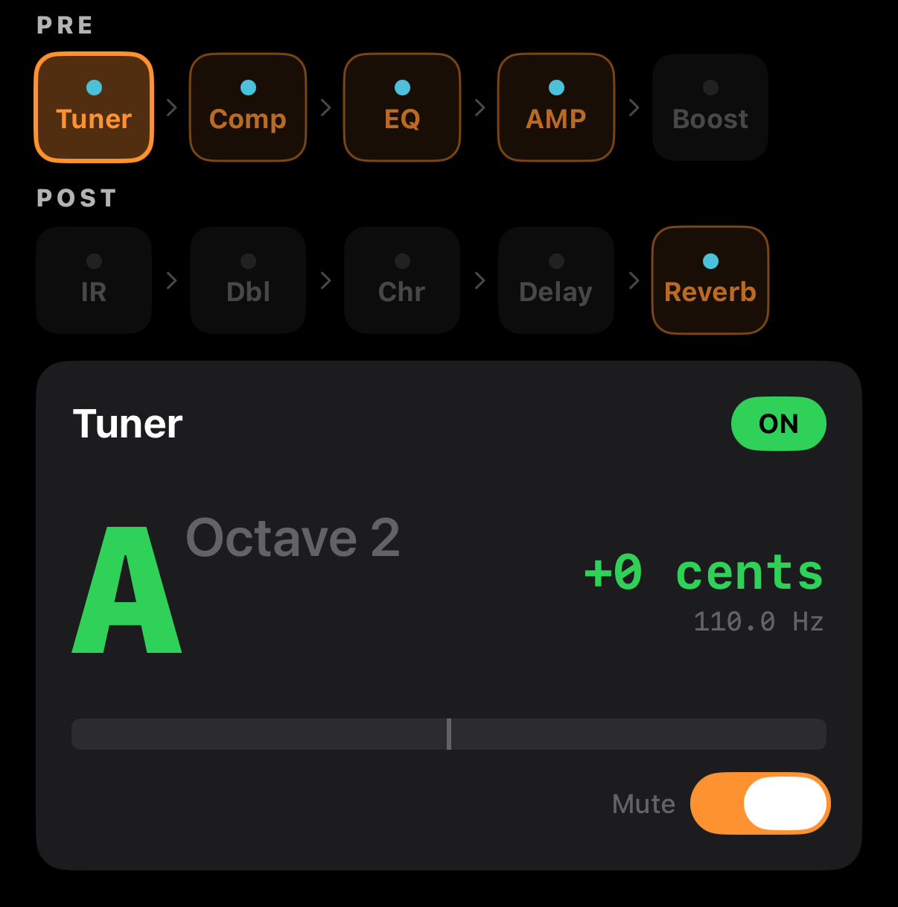

# Tuner — 튜너

입력 신호의 주파수를 분석해 음 이름·옥타브·세미톤 오차(cents)를 표시합니다. 체인 맨 앞에 있어 다른 이펙트의 영향을 받지 않습니다.



## 화면 구성

```
┌──────────────────────────────────────────┐
│  Tuner                        [ ON ]     │
├──────────────────────────────────────────┤
│                                          │
│              A                           │  ← 감지된 음
│           2  -3¢                         │  ← 옥타브  +/- cents
│       ●──────────○──────────●           │  ← cents 게이지
│                                          │
│        440.0 Hz       conf 96%           │  ← 주파수 / 신뢰도
│                                          │
│           [ 🔇  Mute ]                   │
└──────────────────────────────────────────┘
```

## 표시 항목

- **Note (큰 글자)**: A–G♯까지 12개 반음 중 가장 가까운 음
- **옥타브**: 2~6 범위 (어쿠스틱 기타 기본 튜닝 E2~E4 영역)
- **Cents**: 반음 기준 ±100의 미세 오차. `0¢` 부근이면 정확.
- **Cents 게이지**: 가운데 ●이 정확한 음, 양 끝으로 갈수록 높거나 낮음
- **Frequency**: 감지된 주파수 (Hz)
- **Confidence**: 0~100%. 노이즈나 무신호 상태에서는 낮게 나옴

## 조작

### ON/OFF (헤더 캡슐)
- **ON**: 튜너 탭 활성. Mute를 켜지 않으면 입력 신호가 그대로 체인으로 전달됨.
- **OFF**: 튜너 UI는 멈추고 입력은 그대로 통과.

### Mute
- 튜닝 중 관객에게 음이 들리지 않게 출력을 차단.
- 해제하면 즉시 다음 이펙트로 신호가 다시 흘러감.

## 사용 팁

- **공연 중 튜닝 루틴**:
  1. Tuner 선택 → Mute 활성.
  2. 줄 튜닝.
  3. Mute 해제 → 연주 재개.
- **낮은 신뢰도(Confidence < 60%)** 가 지속되면 입력 레벨이 너무 낮거나 코드를 치고 있는 것. 단일 음을 쳐 주세요.
- **드롭 튜닝·다운 튜닝**도 지원됩니다. 옥타브 표시가 자동으로 낮아져요.

## 표준 어쿠스틱 기타 튜닝 참고

| 줄 | 음 이름 | 주파수 |
|---|--------|--------|
| 1 (하이) | E4 | 329.63 Hz |
| 2 | B3 | 246.94 Hz |
| 3 | G3 | 196.00 Hz |
| 4 | D3 | 146.83 Hz |
| 5 | A2 | 110.00 Hz |
| 6 (로우) | E2 | 82.41 Hz |
