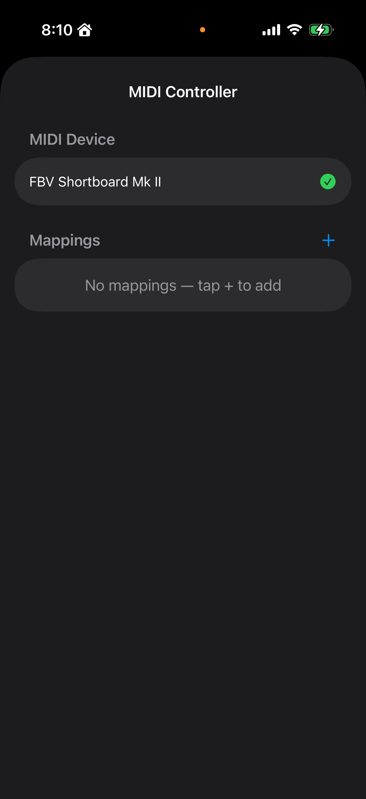
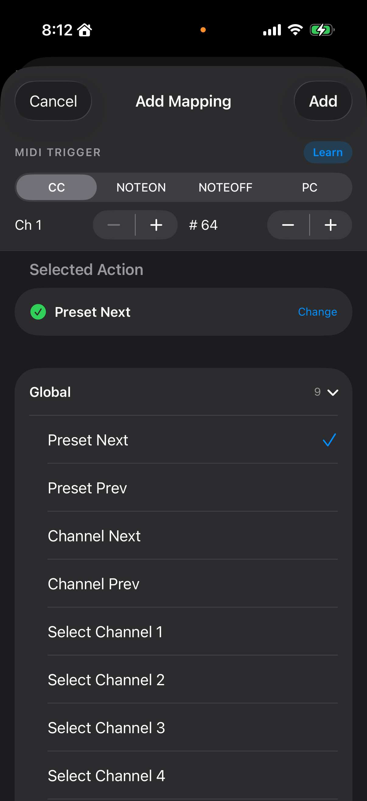

# MIDI 풋컨트롤러 매핑

외부 MIDI 풋컨트롤러나 키보드로 프리셋 전환·이펙트 ON/OFF·루퍼 조작 등을 원격 제어할 수 있습니다.

## 지원 연결 방식

- **USB MIDI** (Lightning-to-USB 카메라 어댑터, USB-C 허브 경유)
- **Bluetooth MIDI** (iOS MIDI Bluetooth 스캔으로 페어링)
- **네트워크 MIDI** (같은 Wi-Fi 네트워크의 컴퓨터 또는 타 iOS 기기)

## 화면 구조

타이틀 바의 **🎛 MIDI** 아이콘 탭 → MIDI Controller 화면.



```
┌─────────────────────────────────────────┐
│  ← MIDI Controller            Done     │
├─────────────────────────────────────────┤
│  MIDI DEVICE                            │
│  ✓  MeloAudio MIDI Commander            │
│                                         │
│  MAPPINGS                            +  │
│  Tap Tempo                              │
│    CC #64 ch 1  →  Tap Tempo   [Learn] │
│  Preset Next                            │
│    CC #65 ch 1  →  Preset Next [Learn] │
│  Looper REC A                           │
│    Note 60 ch 1 →  Looper REC A[Learn] │
└─────────────────────────────────────────┘
```

### 상단: MIDI Device 섹션
연결된 모든 MIDI 장치 목록. 체크 표시된 것이 현재 활성 장치. 하나만 연결돼 있으면 자동 선택됨. 여러 대 연결 시 탭해서 전환.

### 하단: Mappings 섹션
이미 등록된 MIDI 매핑 목록. 각 줄에:
- 매핑 이름 (자동 생성)
- 트리거(어떤 MIDI 메시지가 들어오면) → 액션(무엇을 할 것인지)
- **Learn** 버튼 — 트리거 재학습

오른쪽 상단 **+** 버튼으로 새 매핑 추가.

## 매핑 추가하기

**+** 탭 → Add Mapping 시트.



```
┌─────────────────────────────────────────┐
│  Cancel   Add Mapping          Add     │
├─────────────────────────────────────────┤
│  MIDI TRIGGER                  [Learn] │  ← 고정 상단
│  [ CC  NOTE  NOTE_OFF  PC ]            │
│  Ch 1          # 64                    │
├─────────────────────────────────────────┤
│  SELECTED ACTION                        │
│  (Tap a section below, then pick)      │
│                                         │
│  ▸ Global    (9)                       │  ← 스크롤
│  ▸ Effect   (10)                       │
│  ▸ Looper   (12)                       │
└─────────────────────────────────────────┘
```

### 1. 트리거 지정 (상단, 고정)
어떤 MIDI 메시지에 반응할지 설정.
- **Message Type**: CC (Control Change) / NOTE (Note On) / NOTE_OFF / PC (Program Change)
- **Channel**: 1~16
- **Number**: CC 번호 / Note 번호 / PC 번호 (0~127)

**Learn 방식이 제일 편함**: Learn 탭 → 풋컨트롤러의 원하는 버튼 밟음 → 자동으로 채널·타입·번호가 채워짐.

### 2. 액션 선택 (하단, 스크롤)
3개 섹션으로 그룹화되어 있음. 섹션을 탭해 펼치고 원하는 액션 선택.

#### Global (앱 전체 기능)
| 액션 | 동작 |
|------|------|
| Preset Next / Prev | 저장된 프리셋 다음/이전 순환 |
| Channel Next / Prev | 현재 채널 다음/이전 |
| Channel Select 1~4 | 특정 채널 직접 선택 |
| Tap Tempo | Delay의 Time 파라미터를 탭 템포로 설정 |

#### Effect (이펙트 바이패스)
채널의 10개 이펙트 각각 ON/OFF 토글:
- Tuner / Compressor / EQ / AMP / Boost / IR Loader / Doubler / Chorus / Delay / Reverb

#### Looper (12가지 루퍼 명령)
Loop A, Loop B 각각에 대해:
- Record / Play / Stop / Overdub / Undo / Clear

### 3. Add 탭 → 매핑 완성

## 사용 예시

### Boss FS-7 2버튼 풋스위치로 튜너·솔로부스트 ON/OFF
1. USB MIDI 어댑터로 연결 → 메인 화면에서 장치 자동 인식.
2. + → Learn → FS1 밟음 → CC 82 자동 입력.
3. Effect 섹션 → **Tuner Bypass** 선택 → Add.
4. + → Learn → FS2 밟음 → CC 83 자동 입력.
5. Effect 섹션 → **Boost Bypass** 선택 → Add.
6. 이제 FS1으로 튜너, FS2로 솔로 부스트 원격 ON/OFF.

### MIDI 컨트롤러로 딜레이 탭 템포
1. + → Learn → 탭 템포로 쓸 버튼 밟음.
2. Global 섹션 → **Tap Tempo** 선택 → Add.
3. 해당 버튼을 원하는 템포로 연타 → 딜레이 Time이 자동 계산되어 설정.

### 루퍼 풋스위치 3버튼 (REC / OVR / STOP)
1. FS1 → Learn → Looper 섹션 → **Looper Record (Loop A)** → Add.
2. FS2 → Learn → **Looper Overdub (Loop A)** → Add.
3. FS3 → Learn → **Looper Stop (Loop A)** → Add.
4. 이제 발로만 루퍼 완전 조작 가능.

## 매핑 삭제·수정

- **삭제**: Mappings 리스트에서 해당 줄을 왼쪽으로 스와이프.
- **트리거만 바꾸기**: 각 줄의 **Learn** 버튼 → 새 MIDI 입력 → 자동 갱신 (액션은 그대로).
- **액션 자체를 바꾸려면**: 기존 매핑 삭제 후 새로 추가.

## 참고 사항

- 매핑은 **프리셋과 별개로 저장**됩니다. 프리셋을 바꿔도 MIDI 매핑은 유지돼요.
- 여러 매핑이 같은 트리거에 걸리면 모두 실행됩니다 (의도된 동작일 수도 있지만, 일반적으론 중복 피하는 게 좋음).
- **Parameter 연속 제어(CC로 Knob 움직이기)는 현재 UI에서 지원 안 함** — 이펙트·루퍼의 클릭형 토글만 매핑 가능.
- MIDI 장치가 갑자기 연결 끊기면 Mappings는 유지되지만, 장치 재연결 후 사용 가능.
