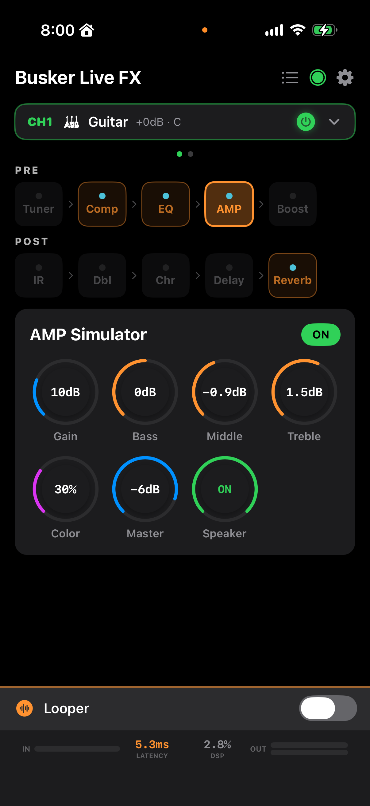
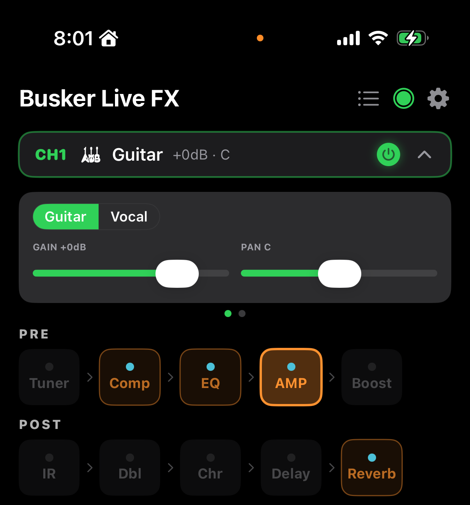
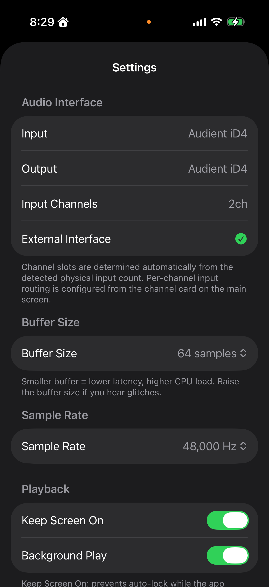

# 전체 기능 가이드

어쿠스틱 기타 전용 멀티 이펙터 앱의 전반적인 기능 설명서입니다. 특정 이펙트의 상세 조작은 [이펙트별 설명서](effects/)를 참고하세요.

## 1. 앱 구조 한눈에 보기

### 1-1. 타이틀 바 (최상단)

- **☰ 프리셋 리스트** — 저장한 프리셋을 불러오거나 현재 상태를 저장
- **🎛 MIDI** — MIDI 풋컨트롤러 매핑 화면 ([MIDI 가이드](midi.md))
- **⚙ 설정** — 오디오 인터페이스, 버퍼 크기, 백그라운드 오디오 등

### 1-2. 채널 헤더 (상단)

기본은 한 줄로 접혀 있습니다. 탭하면 펼쳐지며 채널 타입(Guitar/Vocal)과 Gain/Pan 컨트롤이 나타납니다.

**채널 구조**
- 최대 **4개 채널**(CH1~CH4) 동시 운용. 오디오 인터페이스가 지원하는 물리 입력 수에 맞춰 자동 조정됩니다.
- 각 채널은 **Guitar** 또는 **Vocal** 중 하나로 설정. 둘은 시그널 체인이 다릅니다.
  - Guitar: Tuner → Comp → EQ → AMP → Boost → IR → Doubler → Chorus → Delay → Reverb
  - Vocal: Comp → EQ → Reverb
- 채널 좌우 **스와이프** 또는 페이지 도트 탭으로 이동 (1채널이면 스와이프 불가).

**채널 헤더 조작**
- **CH 숫자 + 🎸/🎤 아이콘**: 현재 채널 타입 표시
- **+3dB · C**: 게인과 패닝 요약 (C=Center, L/R=좌/우 50%라면 L50/R50)
- **⏻ 전원 버튼**: 해당 채널 ON/OFF (꺼진 채널은 신호가 흐르지 않음)
- **⌄ / ⌃ 화살표**: 펼침/접힘 토글
- 펼친 상태에서 **Guitar | Vocal** 캡슐 버튼으로 채널 타입 변경

### 1-3. 시그널 체인 바

현재 채널의 이펙트 배열. 이펙트 박스를 **탭**하면 아래 에디터가 그 이펙트로 전환. **길게 누르기(long press)**면 해당 이펙트 ON/OFF. 녹색 테두리 = 활성, 회색 = 바이패스.

- 각 박스 상단의 작은 막대는 **피크 레벨 미터** (이펙트를 통과한 신호 크기)
- 선택된 이펙트는 파란색 하이라이트

### 1-4. 이펙트 에디터

선택한 이펙트의 파라미터 노브·스위치. 오른쪽 상단 **ON/OFF 캡슐**로 해당 이펙트 바이패스. 노브는 **세로로 드래그**해서 값 조정, 더블 탭으로 기본값 복원.

### 1-5. 루퍼 바 (하단)

항상 보이는 얇은 바. 자세한 내용은 [루퍼 사용법](looper.md) 참고.

- 루퍼 **타이틀 탭**: 상세 패널 펼침/접힘
- **오른쪽 토글**: 루퍼 기능 자체 ON/OFF (OFF 시 DSP 체인에서 제외 → CPU 절약)

### 1-6. 상태 바 (최하단)

- **입력 레벨** (dB 표시 + 막대)
- **샘플레이트 / 버퍼 크기 / 라운드트립 레이턴시**
- **글리치 카운터** (0이면 ✓, 1 이상이면 ⚠)

### 예시: Guitar 1채널 + Vocal 1채널

1. 2채널 이상 지원 오디오 인터페이스 연결 (예: Focusrite 2i2, Audient iD4 등).
2. **CH1** 헤더 탭 → 펼치고 **Guitar** 선택.
3. **CH2**로 스와이프 → 펼치고 **Vocal** 선택.
4. 각 채널에서 시그널 체인 바의 이펙트를 길게 눌러 ON/OFF 설정.
5. 노래 부르며 기타 연주 → 두 채널이 독립적으로 처리되어 믹스 출력.

### 여러 기타를 동시에 쓰고 싶다면

- 4채널 오인페를 쓰면 CH1~CH4 모두 Guitar로 설정 가능.
- 각 채널마다 AMP 세팅·EQ·딜레이를 따로 구성할 수 있습니다.

## 3. 프리셋

**저장하기**
1. 현재 세팅(이펙트 파라미터 + 채널 설정 전체)을 원하는 상태로 맞춤.
2. 타이틀 바 ☰ → **Save Current as Preset** 탭.
3. 이름 입력 → Save.

**불러오기**
1. 타이틀 바 ☰ → 프리셋 리스트에서 원하는 프리셋 탭.
2. 전체 세팅이 즉시 로드됨.

**삭제**
- 프리셋 리스트에서 해당 프리셋을 왼쪽으로 스와이프.

**참고**: 프리셋은 **현재 채널 한정**이 아니라 **4채널 전체 상태**를 저장합니다.

## 4. 오디오 인터페이스

- **필수**: 외부 오디오 인터페이스 사용을 전제로 설계되었습니다. 내장 마이크도 동작은 하지만 레이턴시와 음질이 크게 떨어집니다.
- 권장 레이턴시: 왕복 **5ms 이하 @ 48kHz**, 버퍼 64~128 샘플.
- 지원 장비 예시: Focusrite Scarlett, Audient iD 시리즈, IK Multimedia iRig Pro Duo, Apogee Duet, SSL 2/2+ 등.

**입력 채널 수 인식**
일부 오디오 인터페이스(Audient iD4, SSL 2+, MOTU M2 등)는 **루프백 채널을 포함해 실제보다 많은 채널을 리포트**합니다. 앱은 알려진 장치 목록을 보고 물리 입력 수만 노출하며, 미등록 장치는 ⚙ 설정에서 수동으로 채널 수를 지정할 수 있습니다.

## 5. 설정 (⚙)

- **Sample Rate**: 44.1kHz / 48kHz (기본 48)
- **Buffer Size**: 32 / 64 / 128 / 256 samples (작을수록 지연 적음, 글리치 위험 증가)
- **Background Audio**: 화면 잠금 시에도 오디오 유지
- **Physical Input Channels** (해당 인터페이스가 등록된 경우만): 루프백 제외 실제 입력 수

## 6. 문제 해결

| 증상 | 대처 |
|------|------|
| 소리가 끊기거나 지직거림 | 버퍼 크기를 64→128 또는 128→256으로 증가 |
| 입력 신호가 잡히지 않음 | 오인페 연결 확인, iOS **설정 > 개인정보 보호 > 마이크**에서 앱 권한 확인 |
| 채널 수가 실제와 다름 | ⚙ 설정에서 수동 채널 수 지정 |
| 프리셋 로드 후 소리가 이상함 | 해당 이펙트를 한 번 OFF → ON (리셋) |
| 레이턴시가 너무 큼 | 샘플레이트 48kHz, 버퍼 64 확인. 인터페이스 자체 레이턴시 확인 |

문제가 계속되면 Xcode 콘솔 로그나 오디오 인터페이스 모델명을 GitHub Issue에 적어주세요.
