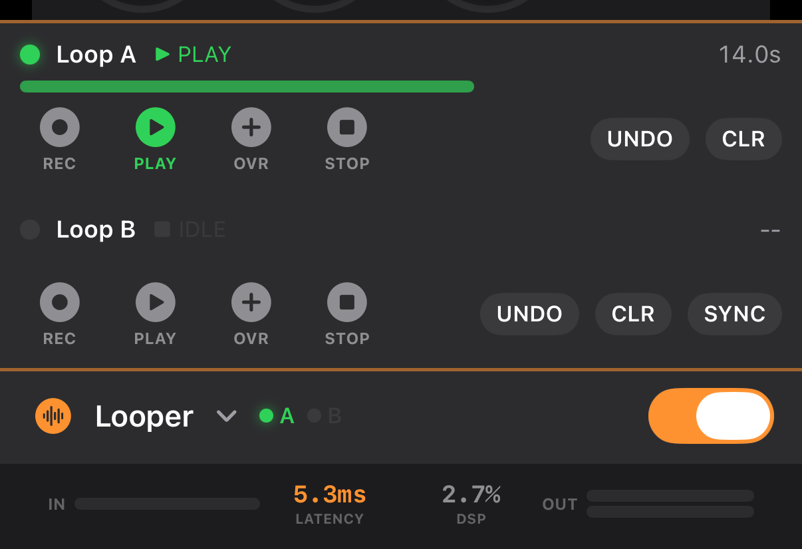

# Looper

Two-slot loop recorder. A thin bar sits permanently at the bottom of the screen, and tapping it expands the detail panel.

## Layout


<!-- SCREENSHOT: collapsed looper bar — Looper title + A/B slot indicator dots + ON/OFF toggle -->

```
🌀 Looper  ⌄   ●A  ○B                     [ ● ON ]
```

- **⌄ / ⌃ chevron** — expand/collapse the detail panel
- **A / B dots** — per-slot state color (red = recording, green = playing, orange = overdubbing, gray = idle)
- **ON/OFF toggle** — enables the looper. Disabled means it's removed from the DSP chain


<!-- SCREENSHOT: expanded looper detail panel — 2 slots, progress bar, control buttons -->

Inside the expanded panel, Loop A sits above Loop B:

```
┌──────────────────────────────────────────┐
│  ●  Loop A   ▶ PLAY                4.2s │
│  ▓▓▓▓▓▓▓▓░░░░░░░░░░░░░░░                │  ← playback position bar
│  [REC] [PLAY] [OVR] [STOP]  UNDO  CLR   │
├──────────────────────────────────────────┤
│  ●  Loop B   ■ IDLE                 --  │
│  ░░░░░░░░░░░░░░░░░░░░░░░░░░░            │
│  [REC] [PLAY] [OVR] [STOP]  UNDO  CLR  SYNC │
└──────────────────────────────────────────┘
```

## Slot States

| State | Color | Meaning |
|-------|-------|---------|
| **Idle (■)** | Gray | Nothing recorded |
| **Recording (●)** | Red | Capturing input into the buffer |
| **Playing (▶)** | Green | Playing the recorded loop |
| **Overdub (◉)** | Orange | Playing while layering in new input |

## Controls

### REC
- From **Idle**: starts recording (red).
- From **Recording**: stops recording and switches to **Playing** automatically.
- Max loop length: **~60 seconds**. Exceeding the limit auto-switches to Playing.

### PLAY
- Plays the recorded loop from the beginning (or keeps position if already playing).
- From **Overdub**: stops layering and returns to plain Playing.

### OVR (Overdub)
- Only works while **Playing**. Layers new input on top of the existing loop.
- Tap again to return to Playing.
- You can keep stacking layers on top of each other.

### STOP
- Halts playback from any state. The recording is preserved.
- Next PLAY starts over from the beginning.

### UNDO
- Removes the most recent overdub layer. The base recording is kept.

### CLR
- Clears the slot entirely → back to Idle.

### SYNC (Loop B only)
- When recording into B, auto-ends at the length of Loop A.
- Example: A is a 4.0 s loop. Hit REC on B, and at 4.0 s it switches to Playing automatically.
- If A isn't recorded yet, SYNC has no effect.

## Examples

### Basic one-slot loop
1. Flip the looper **ON/OFF toggle** to ON.
2. **Loop A** → tap REC → play your part → tap REC again (auto-plays).
3. Play along, tap OVR → add layers → tap OVR again to stop layering.
4. STOP to halt, CLR to erase.

### Two stacked layers (A + B)
1. **Loop A**: record a rhythm (REC → REC).
2. **Loop B**: enable SYNC → REC → it matches A's length automatically.
3. Record lead/harmony into B — plays in sync with A.

### Live overdubbing
1. Record a bass line into A.
2. While A plays, tap OVR → add a harmony → tap OVR to stop.
3. Don't like it? Tap **UNDO** to remove just that layer.

## MIDI Foot Controller

Map footswitches to REC / PLAY / OVR / STOP / UNDO / CLR via the [MIDI guide](midi.md).

Typical mapping:
- Footswitch 1 → **Looper Record (Loop A)** — start/stop recording
- Footswitch 2 → **Looper Overdub (Loop A)**
- Footswitch 3 → **Looper Stop (Loop A)**

## Limits and Tips

- Loops live **in-session memory only**. They're lost when the app quits — record externally if you need to keep them.
- The looper sits **after all signal-chain effects**, so the recorded audio already has your AMP/EQ/delay/reverb baked in.
- Loops A and B are **fully independent** — different tempos and lengths are fine (as long as SYNC is off).
- UNDO only backs out **one** overdub layer. For multiple levels, CLR and re-record.
